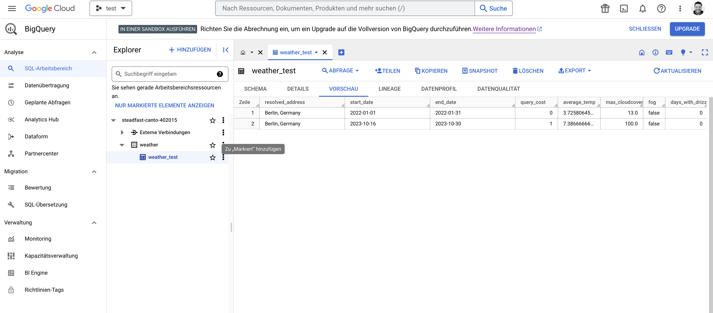
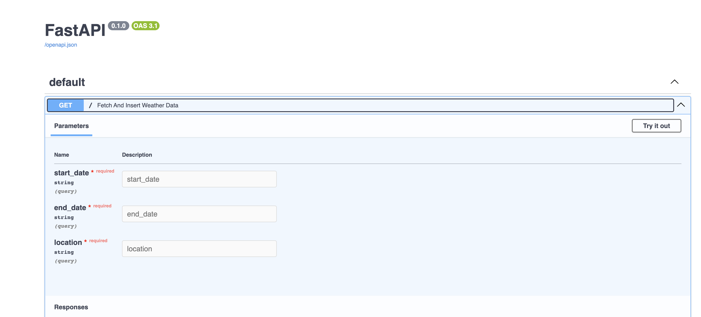

# Weather Data Extraction API

## Overview

Before deploying our data extraction service, it's essential to test the API and ascertain the specific data to be retrieved. This README details the output structure and essential parameters for the API.

## Output Structure

Upon successful extraction, a new entry is added to the target table (`BIG_QUERY_TARGET_ID`). The structure of this entry is as follows:

```json
{
  "resolved_address": "string", // sourced from "resolvedAddress"
  "start_date": "date",
  "query_cost": "number", // sourced from "queryCost"
  "average_temp": "number", // average value from "temp" fields (in Celsius)
  "max_cloudcover": "number", // maximum value from "cloudcover" fields
  "fog": "boolean", // indicates if there was a foggy day
  "days_with_drizzle": "number", // total count of days with any drizzle
  "runtime_timestamp": "timestamp" // the service call runtime, set to the timezone of the requested location
}
```
Note: Including an "end date" can offer insights into the time series range in our database, facilitating a smoother experience for data analysts.
to avoid duplciation and idea will be to use a hashing function with the location and startdate and enddate.-> didn't included

## API Endpoint
To fetch historical weather data, particularly from the previous month, we utilize the following API endpoint:
https://weather.visualcrossing.com/VisualCrossingWebServices/rest/services/weatherdata/history

## Required Input Parameters
For this service, please provide the following input data:

START_DATE: string
END_DATE: string
LOCATION: string
API_KEY: string
GOOGLE_APPLICATION_CREDENTIALS_PATH: string
BIG_QUERY_TARGET_ID: string (Format: “PROJECT.DATASET.TABLE”)
Deployment Considerations
The aforementioned input parameters should be stored as environment variables. This facilitates smoother deployment on platforms like GCP, especially for cloud functions. For security, ensure these parameters are also securely stored within GCP, allowing cloud functions to access and use them as required.

## Data Periodicity
From the task specifications, it's evident we aim to extract data in time series formats, such as monthly, weekly, or daily.

## how to run the script 
first you need to create the enviroment:
python -m venv env

then
source env/bin/activate

install the requieremnts
pip install -r requirements.txt

## Objective
The rationale behind deploying the service as an endpoint is to foster greater flexibility, thereby easing the process of data retrieval for analytics endeavors. This arrangement also lays the groundwork for automation. Moreover, it provides a pathway for the addition of more endpoints, such as a deduplication endpoint, effectively broadening our service scope.

## Prerequisites
Ensure Docker is installed on your machine.
Deployment Steps
Launch the Service:
Navigate to the project directory and execute the following command to 
1. build and run the Docker container:
docker-compose up --build
2. Access the Service:
With the service up and running, access the auto-generated FastAPI documentation by navigating to the following URL in your web browser:
http://localhost:8000/docs#/

Through this setup, a straightforward avenue to run the service as an endpoint is illustrated, enabling a myriad of functionalities tailored to streamline data analytics, automation, and the addition of more endpoints for expanded service offerings.

screenshots:



